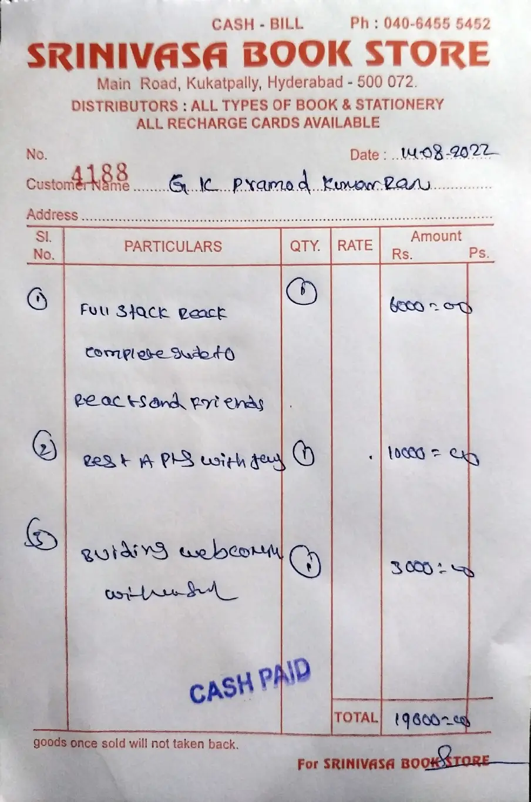

# Handwritten Bill Extraction & Model Evaluation

This project compares multiple AI models on their ability to extract structured information from handwritten Indian bills and receipts. It can run extraction over a folder of bill images, score the results against ground truth, and optionally push validated expenses into Zoho Books.

## Overview

The workflow is:

1. Place bill images in the Bills folder.
2. Run extraction with the configured models.
3. Compare model output against a manually created ground-truth file.
4. Review accuracy, cost, and detailed per-field results.
5. Optionally create expense entries in Zoho Books.

## Screenshots

Sample bill images used in this project:




## Features

- Extract structured fields such as vendor, invoice number, date, amount, currency, and GST details.
- Compare multiple LLM-based extractors on the same images.
- Support for Gemini, Groq, and OpenRouter-backed models.
- Use OpenRouter for GPT and Claude-based extraction providers in addition to native Gemini and Groq integrations.
- Generate evaluation tables for accuracy and cost.
- Launch a Streamlit-based dashboard for interactive review.
- Push accepted extraction results to Zoho Books as expense entries.

## Technologies Used

- Python
- Streamlit
- Google Gemini API
- Groq API
- OpenRouter API
- Pandas
- Requests
- python-dotenv
- python-dateutil
- Zoho Books API

## Project Structure

- app.py — batch extraction runner
- compare.py — scoring and cost evaluation
- ui.py — Streamlit dashboard
- zoho_upload.py — Zoho Books integration
- extractors/ — model-specific extractor implementations
- Bills/ — input bill/receipt images
- output/ — extracted JSON results
- tables/ — evaluation CSV outputs
- ground_truth.csv — manual reference values for scoring

## Setup Instructions

### 1. Clone the repository

```bash
git clone https://github.com/sinlessrook/bill-details-extractor
cd bill-details-extractor
```

### 2. Create and activate a virtual environment

On macOS/Linux:

```bash
python -m venv venv
source venv/bin/activate
```

On Windows:

```bash
python -m venv venv
venv\Scripts\activate
```

### 3. Install dependencies

```bash
pip install -r requirements.txt
```

### 4. Configure environment variables

Copy the example environment file and fill in the required values:

```bash
copy .env.example .env
```

Then update .env with your API credentials:

- Gemini API key from Google AI Studio
- Groq API key from Groq Console
- OpenRouter API key if you want to use the GPT and Claude extractors through OpenRouter
- Zoho Books credentials if you plan to push expenses

Example environment variables:

```env
GEMINI_API_KEY=your_gemini_key_here
GROQ_API_KEY=your_groq_key_here
OPENROUTER_API_KEY=your_openrouter_key_here
```

## Running the Project

### Run extraction

Add your bill images to the Bills folder and run:

```bash
python app.py
```

This writes JSON results into the output folder.

### Fill in ground truth

Create or update ground_truth.csv with the expected values for each bill and field.

### Run evaluation

```bash
python compare.py
```

This generates evaluation tables in the tables folder.

### Launch the UI

```bash
streamlit run ui.py
```

## Evaluation Methodology

The project compares model predictions against a manually prepared ground truth and scores fields using a mix of exact matching and fuzzy matching:

- Vendor name — fuzzy string matching
- GST details — fuzzy matching
- Invoice number and currency — normalized exact match
- Date — parsed and compared as a date
- Amount — parsed and compared numerically

## Notes

- The pricing used for cost estimation should be reviewed periodically, as provider pricing can change.
- GPT and Claude extraction are routed through OpenRouter, so an OpenRouter API key is required for those providers.
- Some extractors may require extra configuration depending on the API provider.

## License

This project is licensed under the MIT License. See the LICENSE file for details.
